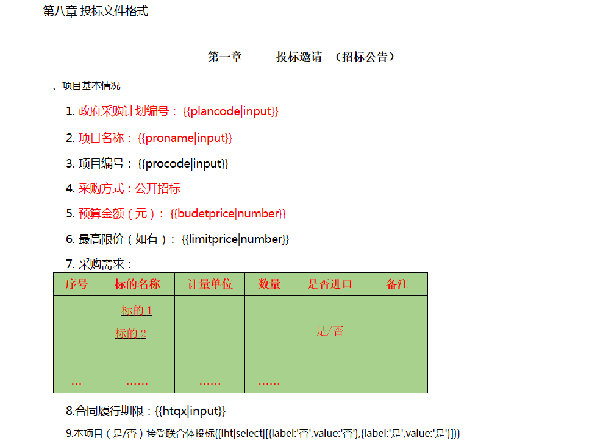
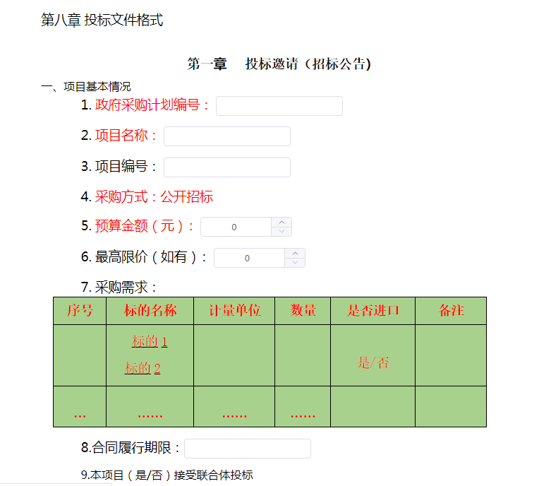

# rt-form-parser

富文本-表单-解析器

## 功能描述

向组件中传入 `带模板的富文本字符串`，解析器将模板内容自动解析为 `表单组件`，并插入到页面中

> 使用场景：自定义带表单的模板，页面美观度取决于富文本编辑的美观度

* 支持模板解析：表单组件、插槽
* 支持数据的双向绑定功能
* 支持必填校验（全部必填）





## 使用说明

### props

| props      | 说明                   | 默认值 |
| ---------- | ---------------------- | ------ |
| value      | 双向绑定的表单变量     | {}     |
| html       | 带模板的html字符串     | ''     |
| size       | 表单大小               | 'mini' |
| strSpliter | 多选数组转字符串连接符 | ','    |

```js
<RtFormParser 
ref="form"
v-model="form"
:html="temp"
>
    <template v-slot:slotOtherSupplementInfo>
        <el-button type="primary" @click="addOtherSupplementInfo">
            添加
        </el-button>
    </template>

    <template v-slot:slotOtherSupplementInfoContent>
        <div v-html="otherSupplementInfoContent"></div>
    </template>
</RtFormParser>
```

### methods

| methods  | 说明                                                                         |
| -------- | ---------------------------------------------------------------------------- |
| validate | 校验表单是否全部填写，如果有没填写的内容，屏幕会自动滚动至第一个为空的内容处 |

```js
// ...
methods: {
    // ...
    // 提交表单
    submitHandler() {
        this.$refs.form.validate(valid => {
            if (!valid) {
                // 校验不通过，有为空项
                console.log(false);
                console.log(this.form);
                return;
            }

            // 校验通过，执行提交
            console.log(true);
            console.log(this.form);
        });
    },
    // ...
},
// ...
```

## 模板说明

模板格式：`key|type|data`

对应位置值说明：

1. key：表单绑定值对应的键，如form.name，则对应值为name
2. type：解析的控件类型，详见下表
3. data：额外参数，如控件对应的可选数据、日期选择的类型，详见下表

支持的模板内容及说明

| 内容示例                                                              | 说明                                                                                  |
| --------------------------------------------------------------------- | ------------------------------------------------------------------------------------- |
| {{name}}                                                              | 等价于：{{name\|input}}<br />解析成一个输入框                                         |
| {{detail\|textarea}}                                                  | 解析成一个textarea                                                                    |
| {{age\|number}}                                                       | 解析成一个number类型的input，最小值为0                                                |
| {{checkbox\|checkbox\|[{label:'1',value:'1'},{label:'2',value:'2'}]}} | 解析成一组checkbox，可选值为第三个参数，即1、2                                        |
| {{radio\|radio\|[{label:'1',value:'1'},{label:'2',value:'2'}]}}       | 解析成一组radio，可选值为第三个参数，即1、2                                           |
| {{select\|select\|[{label:'1',value:'1'},{label:'2',value:'2'}]}}     | 解析成一个select，可选值为第三个参数，即1、2                                          |
| {{addtime\|date\|datetime}}                                           | 解析成一个日期选择器，选择器的类型为第三个参数，可取值：date/week/month/year/datetime |
| {{slotname\|slot}}                                                    | 解析成一个具名插槽，插槽名字为第一个值                                                |

```js
<!-- 模板示例 -->
export default `
<div>
    <div>{{name}}</div>
    <div>{{detail|textarea}}</div>
    <div>{{age|number}}</div>
    <div>{{checkbox|checkbox|[{label:'1',value:'1'},{label:'2',value:'2'}]}}</div>
    <div>{{radio|radio|[{label:'1',value:'1'},{label:'2',value:'2'}]}}</div>
    <div>{{select|select|[{label:'1',value:'1'},{label:'2',value:'2'}]}}</div>
    <div>{{addtime|date|datetime}}</div>
    <div>{{slotname|slot}}</div>
</div>
`
```

## 注意

本解析器将模板解析为 `element-ui表单组件`，如需进行调整，请前往 `package/rt-form-praser/mixins/parsers.js`进行调整
